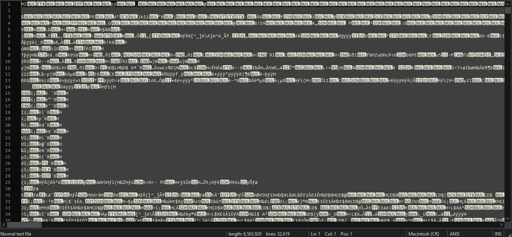
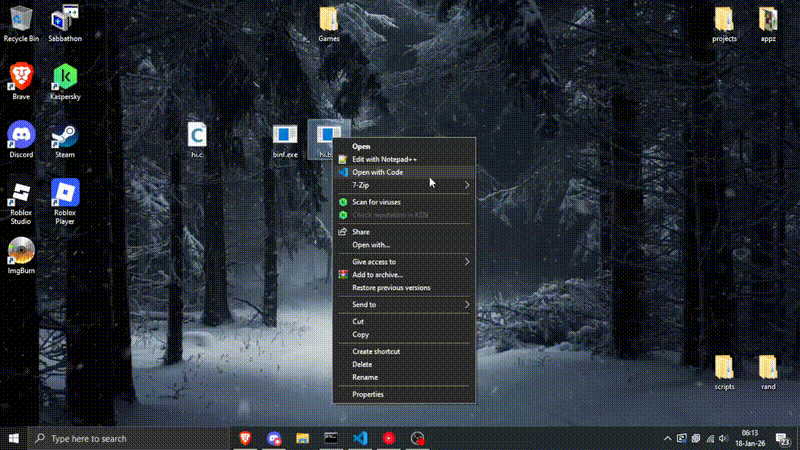

# **binf** - *a very useless tool...*

Have you ever ~~coded in **C** with your life on the line~~ opened a `.exe` file in **NotePad** or **NotePad++** or whatever and you see something like this.



And then you frown n' all cause it's not *ACTUALLY* machine code that you can read; so disappointing.

Well look no further to `binf.exe`, where said dream comes true!

## *"What the fuck is `binf.exe`?"*
Well, **binf**, yeah I don't have an original name for it; leave me alone. But back on topic what my tool does is turn `.exe's` -> `.bxe's` *(binary executables)* files.

## *"What does that mean...?"*
So basically, turn this mess of machine code from a `.exe` file into a *"clean"* binary *(1's and 0's)*. And that resulting `.exe` ends up looking something like this...



## *"Why would anyone use this?"*
Well uh, to answer your question; you really shouldn't unless you wanna mess around. While this tool does have SOME use cases which I will mention in a bit.

## *What this tool contains / offers...*

### **Encryption**
It seems every tool I make *ALWAYS* links back somethin' to do with encryption. Anyways `binf.exe` uses **AES-256-GCM** for it's main encryption algorithm.

`AES` which stands for **Advanced Encryption Standard** is the cipher.

`256` which is the key value which is stupid long that even authentication can't crack it *IF* it provides a good / strong password.

`GCM` which stands for **Galois / Counter Mode** is an authentication tag that checks if the file has been tampered; if it has, it drops it and can't decrypt to it's original state.

### **Argon2ID**
Like any sane person I picked **Argon2ID** over **PBKDF2** as this tools `KDF`. Argon2ID is the winner of the password hashing competition in 2015; this `KDF` is bulky, RAM intensive... which is good in our case for password hashing since even GPUs struggle with this.

### **Password**
Now in realistic terms if you want the encryption to be *GOOD*, you'd set your own password. Using the tool's default one is good if you don't care about the encryption much.

Keep in mind, a weak password example `1234` or `password` = weak encryption, `AES` will not be responsible for your stupidity.

### **RAM-only execution**
See, instead of running a `.exe` like normal which is written on your disk; `binf` will run it directly in your RAM / memory; so the executed `.bxe` file never touches your disk itself.

This is achieved by making a custom `PE` loader that allocates the metadata to the RAM correctly. This gives `.bxe's` a slight advantage for apps that you need to run without leaving traces.

### **Zero-ing**
After the `.bxe` returns a `return code: null` the tool automatically wipes / zero's the code of the app you are running from memory.

Same applies for password when the `.bxe` originally created.

### **VFS (Virtual File Storage)**
**VFS** is used to emulate your computers storage alone in RAM, that means if a `.exe` needs a certain file to run; turning it into a `.bxe` will still work.

However; this **VFS** shit that I've made is far from flawless but... better anything than nothing.

### **Windows integration**
Double clicking a `.bxe` file (assuming you've ran `binf install cm` and `binf path`) will decrypts and runs the file and run it just like a regular `.exe`; pretty neat?

### **MIT license**
Explains itself on what it does. Do anything with the app, and I won't deal with your problems.

### **The punchline™**
See now the reason why I say that this is a stupid useless app is because since we turn machine code into readable binary *ASCII*, which inflates a file by **8** times; so do the math when binarifying files with this tool.

**PLEASE**  use this tool with caution I beg...

## *"Okay... I wanna use this tool." (I doubt that but okay)*
Anyways to use this tool, I will recommend the following...

### **General C compiler**
If you wish to view the source code and compile it yourself, you will need a **GCC** installed and added to your systems `PATH`. Otherwise running `build.bat` will fail.

You can install **GCC** by installing **MYSYS2** ([here rofl](https://www.msys2.org/)); after it's installed, open up **UCRT64** and run the following command.
```bash
pacman -S mingw-w64-ucrt-x86_64-gcc
```

This only applies if you don't have a version of **GCC** (x64) installed and in your `PATH`, else wise skip this step.

### **Libraries**
Once you have **GCC**; in **UCRT64** run the following commands to install `OpenSSL` and `Argon2ID`.
```bash
pacman -Syu
pacman -S mingw-w64-ucrt-x86_64-openssl
pacman -S mingw-w64-ucrt-x86_64-argon2
```

Installing these might take a few, so be patient.

### **Build it**
Once that is installed you can verify by running `gcc --version` and proceed if you get an output. And then either from the terminal or by double clicking on it; run `build.bat` to compile the tool.

The script will ask you for some preferences, follow the instructions.

### **Setup and configure**
Once that is done, put `binf.exe` you find in your `dist\` folder after compiling; save it somewhere... example `C:\Tools\binf\` or anywhere you'd like.

Once that is done, open **CMD** as administrator where your `binf.exe` lives and run the following commands we mentioned earlier.
```bash
binf install cm
binf path
```

To remove `.bxe` integration you can run the following command...
```bash
binf uninstall cm
```

For the `PATH` environment variable, you will have to manually remove it.

### **Skip all of that bullshit and download a precompiled binary**
If you don't feel like downloading a compiler or compiling the app yourself, you may download a precompiled binary for `binf.exe`; you will still have to do previous step to setup and configure.

### **Usage**
Once you have everything setup, you may run the following command to get all of the help you'll need for `binf.exe`;
```bash
binf -h
```

this here will show any and all help commands to show you how to use the tool. And that's it, use with caution.

## *"That's it?"*
Yeah, that's it... will this tool ever get updated? Well God only knows, if you want a *little* more serious project from me; check out **PyKryptor** (shameless self promo).